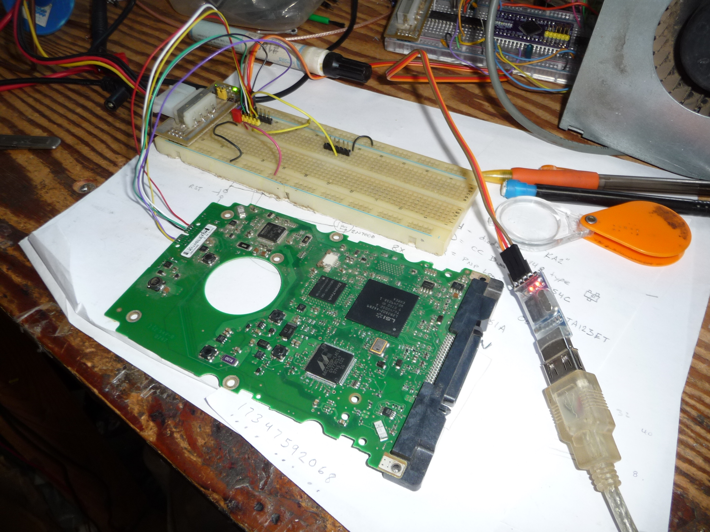
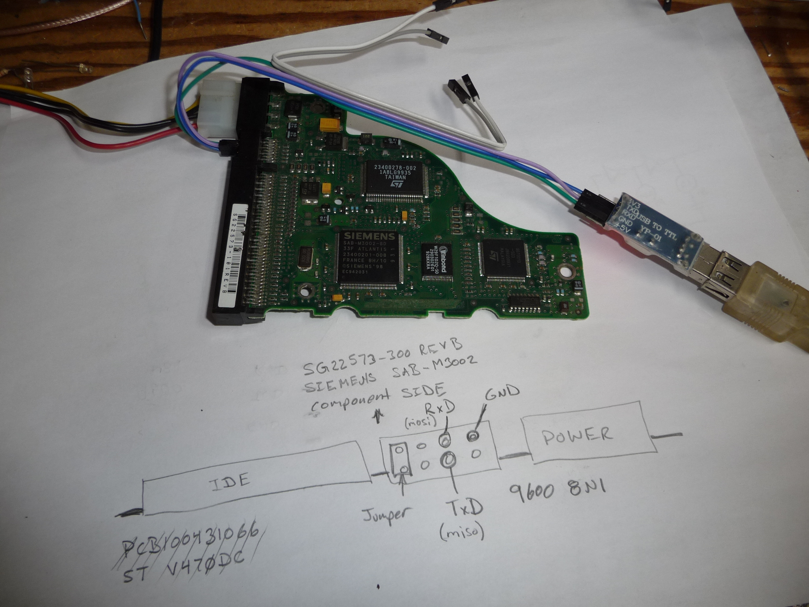
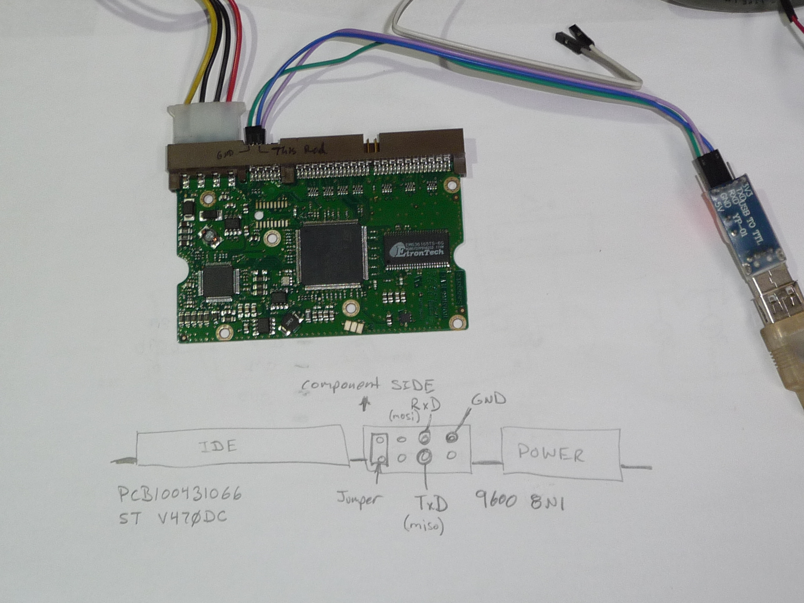
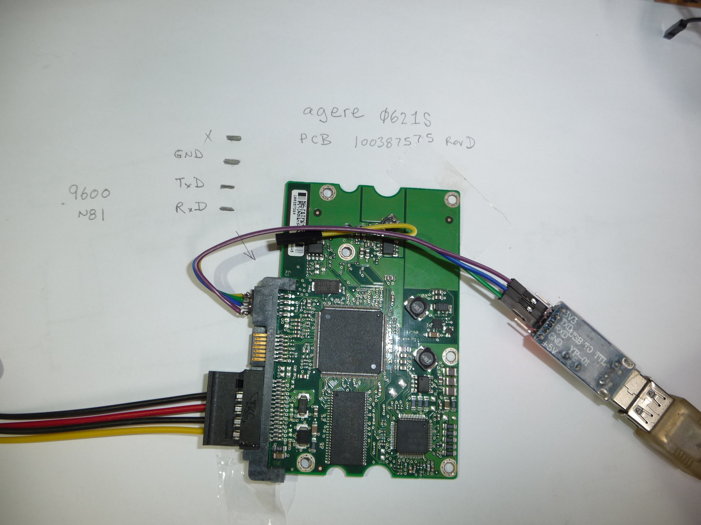

# seaduino
seagate controller repurposement!

The goal of this project is to repurpose seagate harddrive controllers for electronics projects.
Lets see how far we can take it!

*for the unit I'm using*
(my unit seems to be from a STT14685 CLAR146)
The drive (ok, mine anway) needs to be supplied with 5 and 12V (maybe we can get rid of the 12 later)
There is a boot mode pin that needs to be grounded
Serial is at 38400 baud 8N1 

The above boards connections can be found in utils/notes.txt

Here are the other two console connection types that are known:
These seem to use 9600 baud.

